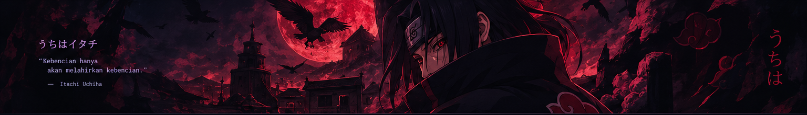

<div align="center">



# 𝙁𝘼𝙍𝙃𝘼𝙉𝙐 𝙌𝘼𝙇𝘽𝙄

### Informatics Engineering Student | Aspiring Web Developer

[](https://github.com/farhanqalbii)
[](https://github.com/farhanqalbii)

</div>

---

## 🩸 About Me

```text
Name       : Farhanu Qalbi
Education  : D3 Teknik Informatika
Campus     : Politeknik Negeri Cilacap
Interest   : Web Development & Software Engineering
Mindset    : Learn, Build, Improve.
🎓 Mahasiswa D3 Teknik Informatika di Politeknik Negeri Cilacap
💻 Tertarik pada pengembangan aplikasi web dan sistem informasi
🚀 Belajar melalui perkuliahan dan berbagai project
🧠 Terus meningkatkan kemampuan coding dan problem solving
⚔️ Tech Stack
<p align="left">  </p>
🔥 Featured Project
Sistem Laboratorium Lingkungan Terpadu

Project pengembangan sistem informasi berbasis web untuk mendukung pengelolaan informasi laboratorium lingkungan secara terintegrasi.

🩸 Currently Improving
🔴 Laravel & PHP
🔴 MySQL
🔴 Web Development
🔴 Problem Solving
🔴 Clean & Maintainable Code
🔴 Portfolio Development
🌑 Contribution Activity

Consistency Over Intensity.

<div align="center">
月読 · Keep Moving Forward

"Learn from yesterday, build today, improve tomorrow."

</div>
